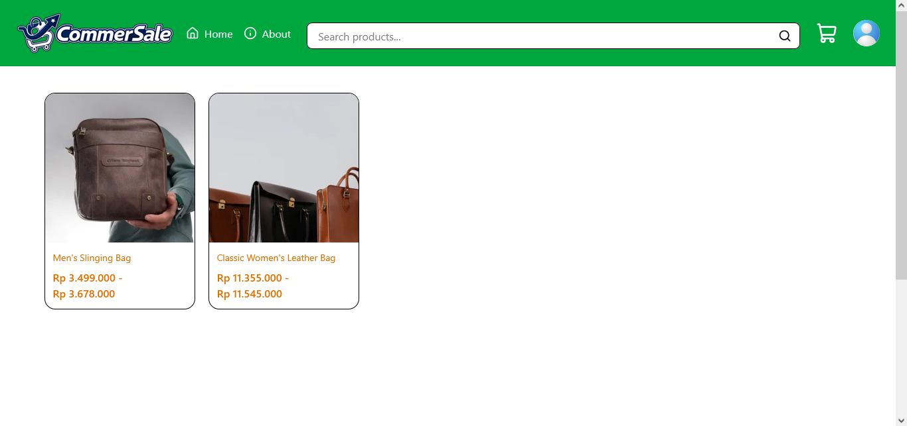
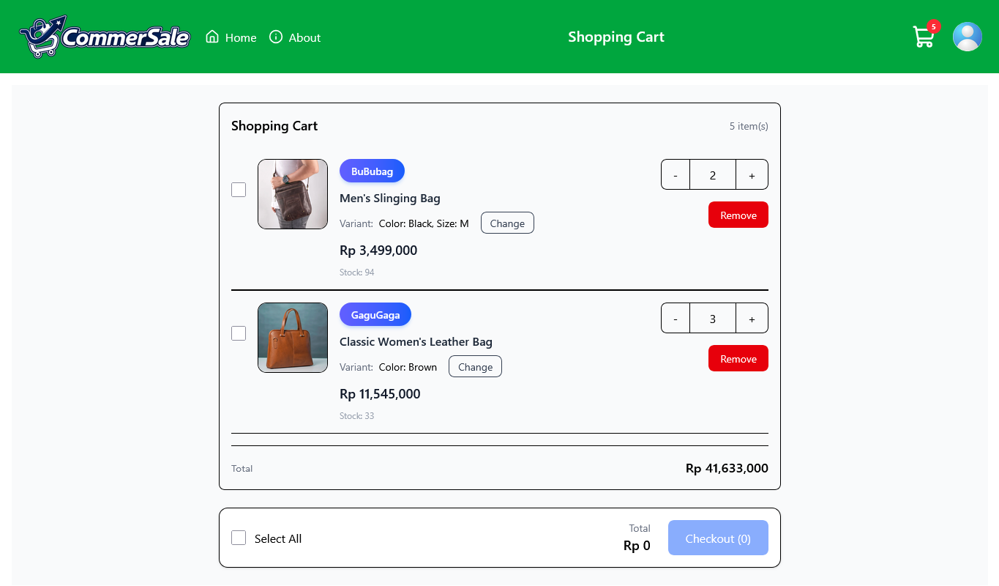
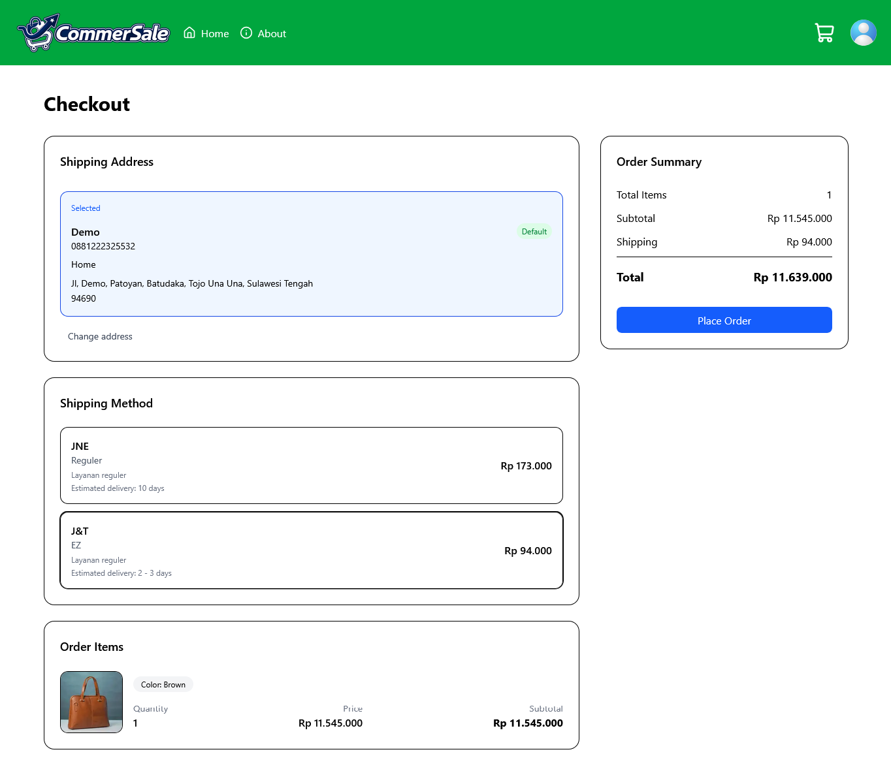
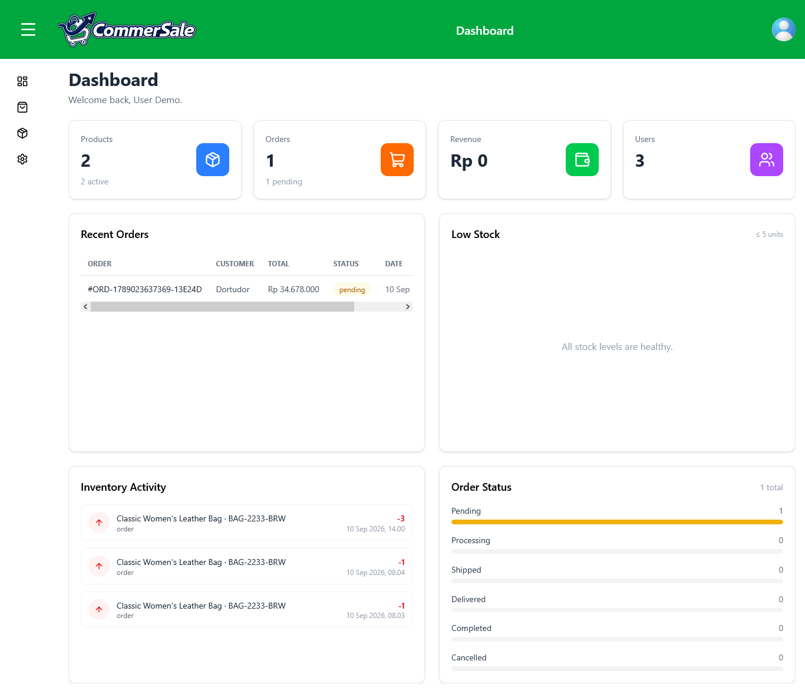

# CommerSale

A full-stack e-commerce web application built with the MERN stack.

CommerSale provides a complete shopping experience, from browsing products and managing a shopping cart to checkout, payment, shipping, and order management.

## Live Demo

**Website:** https://commer-sale.vercel.app

## Features

### Customer

- Register and login
- Browse and search products
- View product details and variants
- Add products to cart
- Buy products directly with **Buy Now**
- Manage shipping addresses
- Calculate shipping costs
- Checkout and place orders
- Make payments through Midtrans
- View order history
- View order details
- Cancel orders

### Admin

- Manage products
- Manage product variants
- Upload product images
- Manage inventory
- View and manage orders
- Manage store information
- Manage application settings

## Tech Stack

### Frontend

- React
- Vite
- Tailwind CSS
- React Router
- Axios

### Backend

- Node.js
- Express
- MongoDB
- Mongoose
- JWT
- Argon2

### Third-Party Services

- **MongoDB Atlas** — Database
- **Cloudinary** — Image storage
- **Midtrans** — Payment gateway
- **Biteship** — Shipping and courier rates

## Project Structure

```text
simple-ecommerce-api/
├── client/     # React frontend
├── server/     # Express backend
├── shared/     # Shared constants and utilities
├── package.json
└── README.md
```

## Getting Started

### 1. Clone the repository

```bash
git clone https://github.com/irmanfhzy/mern_ecommerce_api.git
cd mern_ecommerce_api
```

### 2. Install dependencies

```bash
npm install
```

### 3. Configure environment variables

Create the required `.env` files for the client and server.

The application requires configuration for services such as:

- MongoDB
- JWT
- Cloudinary
- Midtrans
- Biteship

The project provides `.env.example` files for both the client and server.

Copy the example files to `.env` and fill in the required values:

````bash
cp server/.env.example server/.env
cp client/.env.example client/.env

### 4. Run the application

Start the development environment with:

```bash
npm run dev
````

The frontend and backend will run according to the configuration in the project.

### 4. Log in to the application

You can log in to the application using the following demo administrator account:

Email: demo@example.com
Password: Demo123

Alternatively, you can register an account using your Google account. You can also register manually on the registration page.

However, accounts created through registration are assigned the user role by default and cannot access admin features.

## Main Technologies

| Technology   | Purpose          |
| ------------ | ---------------- |
| React        | Frontend         |
| Vite         | Frontend tooling |
| Tailwind CSS | Styling          |
| Node.js      | Backend runtime  |
| Express      | REST API         |
| MongoDB      | Database         |
| Mongoose     | MongoDB ODM      |
| JWT          | Authentication   |
| Cloudinary   | Image storage    |
| Midtrans     | Payment          |
| Biteship     | Shipping         |

## API

The backend provides REST API endpoints for:

- Authentication
- Users
- Products
- Product variants
- Cart
- Orders
- Inventory
- Payments
- Application settings
- Admin management

## Screenshots

### Home



### Product Detail



### Checkout



### Admin Dashboard



## Author

**Irman Fahrezy**

GitHub: https://github.com/irmanfhzy
